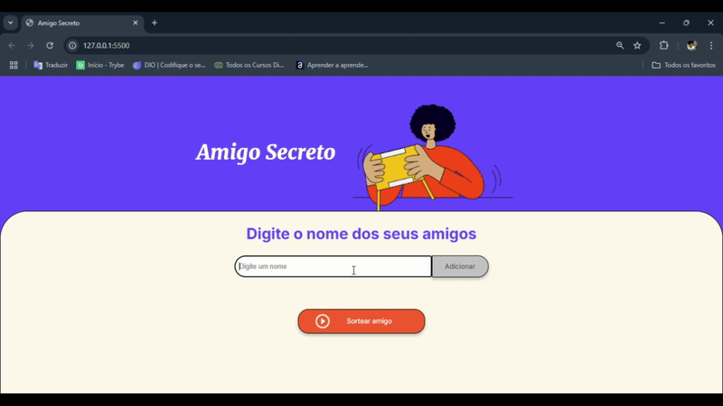
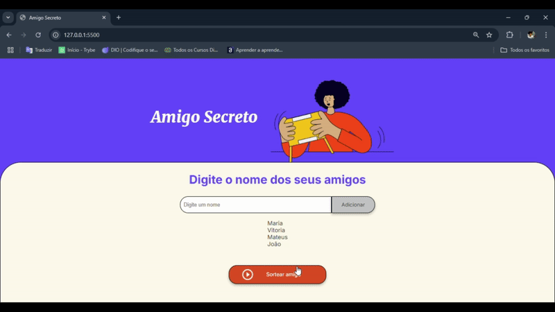

# 🎯 Challenge Amigo secreto

---

**Bem-vindo ao Amigo Secreto!**  

Este é um projeto simples e divertido, desenvolvido em **HTML**, **CSS** e **JavaScript**, que permite adicionar nomes de amigos e realizar sorteios aleatórios de forma prática e interativa.  

Este projeto faz parte dos **Challenges Alura**, uma iniciativa do programa **ONE (Oracle Next Education)** em parceria com a **Oracle**, com o objetivo de fortalecer habilidades em lógica de programação e desenvolvimento web.

--- 

## 📋 Funcionalidades

### 1. **Adicionar Amigos**

- Insira o nome de um amigo no campo de entrada e clique no botão **Adicionar**.
- O nome será adicionado a uma lista visível na tela.

### 2. **Listar Amigos**

- À medida que os nomes são adicionados, eles aparecem em uma lista organizada para garantir que ninguém seja esquecido.

### 3. **Sorteio Aleatório**

- Clique no botão **Sortear Amigo** para selecionar aleatoriamente um dos nomes da lista.
- Após o sorteio, a lista de amigos desaparece e o resultado do sorteio é exibido na tela.

### 4. **Validação**

- O sistema impede que nomes em branco sejam adicionados.
- Uma mensagem de alerta é exibida caso tente realizar o sorteio sem nomes na lista.

---

## 🛠️ Tecnologias Utilizadas

- **HTML**: Estrutura básica da interface.
- **CSS**: Estilização simples para uma aparência limpa e funcional.
- **JavaScript**: Manipulação da lógica, interação com o DOM e sorteio aleatório.

---

## 🚀 Como Executar o Projeto

1. **Clonar o repositório**:

   ```bash
   git clone https://github.com/MateusSanfer/challenge-amigo-secreto-ONE.git
   ```

2. **Abrir o arquivo HTML**:

   - Navegue até o diretório onde os arquivos estão salvos.
   - Abra o arquivo `index.html` diretamente no navegador.

3. **Adicionar Amigos e Realizar o Sorteio**:
   - Insira os nomes no campo de entrada e clique em "Adicionar".
   - Clique em "Sortear Amigo" para realizar o sorteio.

---

## 🎥 Demonstração

### Adicionando Amigos:


### Realizando o Sorteio:


---

## 🌐 Acesse o Projeto

O projeto está publicado no GitHub Pages e pode ser acessado através do link abaixo:  
➡️ [**Amigo Secreto no GitHub Pages**](https://mateussanfer.github.io/challenge-amigo-secreto-ONE/)

---

## 📂 Estrutura do Projeto

```
amigo-secreto/
assets/
├── index.html       # Estrutura principal do projeto
├── script.js        # Lógica do projeto (JavaScript)
├── style.css        # Estilos do projeto
└── README.md        # Documentação
```

---

## 📦 Melhorias Futuras

- Implementar um botão para "reiniciar" o sorteio.
- Permitir sortear vários nomes sem repetições.
- Adicionar um contador para mostrar quantos amigos foram adicionados.

---

# 🧑🏾‍💻 Autor 
| [<br><sub>Mateus Sanfer</sub>](https://github.com/MateusSanfer) | 
| :---: | 

---

## 🖊️ Licença

Este projeto é de código aberto e está disponível sob a licença MIT.

---
